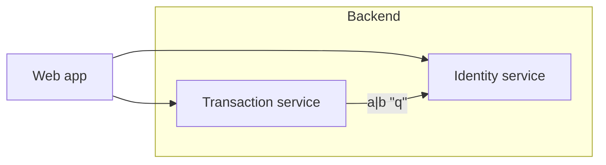

# Runtime QA round 2 · Interactive plan documents

**When:** 2026-09-19
**Tier:** FULL — re-drive of four round-one defects plus the round-one NOT_COVERED list; multi-surface (document editor, diagram editor, comments sidecar, source view, host watcher), persistence across a real relaunch.
**Artifact:** desktop / packaged app (Electron, driven with Playwright-Electron)
**Build under test:** `conduit-wt-plan` at `G:\awby\projects\conduit-wt-plan`, branch `feat/interactive-plan` @ `c57dc21` ("fix(plan): Retry re-derives from the document instead of the splice base")
**Build identity confirmed from the running artifact:** the worktree was verified clean at `c57dc21` before building (`git status --porcelain` empty, `git rev-parse --short HEAD` = `c57dc21`); `npm run build` was run in that worktree (exit 0) and every scenario launched Electron with `args: [--user-data-dir=<fresh>, REPO]` where `REPO` resolves to that worktree (`test/e2e/harness.mjs:21`). There is still no in-app version banner to read back, so identity rests on the single-worktree launch path; each launch used a fresh `--user-data-dir` under the OS temp dir, and no other Conduit process was running. The pane path, tab titles and breadcrumbs in every capture show only temp roots created by this run.
**Environment:** `npm run build` in the worktree, then scenarios run **one at a time**, nothing else running. The app launches hidden (`CONDUIT_E2E=1` → `show:false`).
**Isolation:** no ports. Each scenario got a fresh `--user-data-dir` (`mkdtempSync`) and its own temp project root(s). Screenshots to `%TEMP%\claude-scratch\plan-qa2\` by absolute path.
**Configurations driven:** the profile's default theme (`aero-dark`, read back from `settings.json`), one window size, Windows 11 / win32. Other themes were **not** driven (see Not covered).
**Teardown:** yes — every app closed through the harness `cleanup()` / `closeApp` path (never by image name), every temp project root and user-data dir removed, the read-only fixture and the locked sidecar `chmod`-ed back before removal, all 6 throwaway scenario files deleted, all 38 screenshots and the build log deleted. `git status` in the worktree is clean (verified after teardown).

## Scope

Two things, in order: (1) re-drive the four defects round one failed on, in the branches the committed `plan-*` scenarios do **not** reach, and (2) go after the round-one NOT_COVERED list, highest value first. The three committed scenarios were run first as a regression baseline.

## Verdict

**`fail` — on one defect, and it is a regression of the same round-one finding in a new place.** Everything else re-drove clean, including all three other round-one defects, the round-one blocker (`|` in an edge label), the conflict **Keep mine** branch, read-only refusal, the Delete key, the comment detached/unsaved states, the 4 KB composer cap, a non-permission save failure, and relaunch/restore.

The one failure: **not-found's "Recreate empty" writes the file and then leaves the pane dead** — the plan is recreated on disk but the pane stays on "This plan was deleted." indefinitely. Round one found the not-found state unreachable; it is now reachable, and its primary action does not work.

## Regression baseline — the three committed scenarios

| Scenario | Result |
|---|---|
| `plan-editor` | PASS (38.4 s) |
| `plan-blocks` | PASS (32.7 s) |
| `plan-handoff` | PASS (21.1 s) |

These now carry the fixers' own assertions for several round-one defects (`plan-editor` (d)/(e)/(f), `plan-blocks` keyboard delete + zero-byte plan). Everything below was driven **independently**, with my own scenarios and my own assertions, so no re-drive here rests on a test written by the person who wrote the fix.

## The four round-one defects, re-driven

### 1. Send went to the wrong project's agent — **fixed**

Driven by the committed `plan-editor` (e): two projects, agent writes into the non-active one, toast → Open → edit → Send; the paste spy records the **owning** session, and the handoff names the edited plan. PASS.

**The new refusal branch — driven independently** (`planqa2-defects`, 5/5 checks). From a clean start: open project A; the agent writes `.conduit/plans/refuse.md`; the toast fires (`durationMs: 0`, so it outlives the session); send `exit\r\n` to A's PTY so the session auto-closes; then click **Open**.

Observed, verbatim:

```
No open session owns c:/users/karam/appdata/local/temp/conduit-q2d-tya8j1,
so refuse has no agent to send to. Open that project first.
```

- an error-variant toast, naming both the root and the slug, and saying what to do
- **no plan tab opened** (tab count 1 → 1; `.tab` matching `refuse.md` = 0)
- **no plan pane mounted** (`.plan, .plan__editor, .plan__state` = 0)

It refuses rather than mis-binding, and it does not open a dead tab. Evidence: `01-refusal.png`.

### 2. Deleting an open plan left a dead pane — **half fixed; Recreate empty is broken** (Finding 1)

`plan-editor` (d) covers the not-found state and **Close**; both re-observed clean, and I re-observed the same independently: the pane reaches `.plan__state` "This plan was deleted." with **Recreate empty** and **Close**, and `.viewer__notice` count is 0 (the generic doc-store branch no longer owns the pane).

**Recreate empty does not work.** See Finding 1.

### 3. Load-failed had no way to see the bytes — **fixed, both causes**

Driven independently for both causes plus two NUL variants (`planqa2-defects`).

| Cause | Reason shown | Open as text |
|---|---|---|
| invalid UTF-8 | `Can't open this plan: plan unreadable: not valid UTF-8` | offered; renders the bytes in `.plan__source-view` |
| over 2 MB | `Can't open this plan: plan unreadable: 2097224 bytes exceeds the 2097152 byte limit` | offered; source view mounted and showed `# big` + the padding |
| NUL only (`0x00`, no invalid byte) | — | **loads as a normal plan.** NUL is valid UTF-8, so the loader accepts it; `.plan__editor` = 1, no error state. Correct, and worth knowing. |
| NUL + invalid UTF-8 | `Can't open this plan: plan unreadable: not valid UTF-8` | offered; falls back to `There is no text to show: this file is binary.` — **not** an empty editor |

The reason line stays visible above the source with a **Hide source** toggle (`.plan__state--bar` count 1), so the user never loses the explanation. Evidence: `04-oversize-failed.png`, `05-oversize-as-text.png`, `06-nul-only.png`, `08-nulbad-as-text.png` (read: reason bar on top, "There is no text to show: this file is binary." centred in the body).

### 4. An empty-bodied plan was uneditable — **fixed, including the round trip**

Driven independently for all three shapes and the round trip (`planqa2-defects`, 5 checks each):

| Plan | First keystroke on disk | Bar | Retry offered |
|---|---|---|---|
| frontmatter-only (`---\ntitle…---\n`) | `---\ntitle: Shell only\nstatus: draft\n---\nONLYFM-BODY\n` | `Saved` | 0 |
| whitespace-only (`   \n\n\t\n  \n`) | `WSONLY-BODY\n` | `Saved` | 0 |
| zero-byte | `ROUNDTRIP-BODY\n` | `Saved` | 0 |

Each case also asserts the round-one **false "Saved"** cannot recur: `Saved` is only accepted when the typed text is actually on disk. It held in every case.

**The round trip** — type into an empty plan, `Ctrl+A`/`Backspace` all the way back to empty, type again:

- emptying reached disk (`"\n"`), bar `Saved`, no failure
- retyping reached disk (`"SECOND-PASS\n"`), bar `Saved`, Retry count 0
- editor text and file agree (`editor="SECOND-PASS"`, `disk="SECOND-PASS\n"`)

The reconciliation survives the round trip. Evidence: `09-onlyfm.png`, `09-wsonly.png`, `09-roundtrip.png`, `10-roundtrip-emptied.png`, `11-roundtrip-retyped.png`.

## What round one did not cover — now driven

### Conflict banner, "Keep mine" — pass (10/10)

Typed ` MINE-TEXT`, let the agent rewrite the file 120 ms later (inside the 300 ms debounce), banner raised. While it stood, disk held `THEIRS-TEXT` and never `MINE-TEXT` — write-through stays paused. After **Keep mine**:

- `MINE-TEXT` is on disk; `THEIRS-TEXT` is gone from disk
- the untouched mermaid fence is byte-identical to the fixture's
- the banner clears
- the editor agrees (`MINE=true THEIRS=false`)
- **the editor is live again** — a further ` AFTER-KEEP` wrote through, so the conflict's read-only does not strand the document

Evidence: `20-conflict-banner.png`, `21-keep-mine-settled.png`.

### Diagram Delete by keyboard — pass (15/15), driven independently

Clicked the `txn` node → `.planflow__node--selected` = 1 → pressed **Delete**: the node left the fence in 532 ms, **both** its edges went with it, the unrelated node and edge survived, and the fence contains exactly one `identity[Identity service]` (no stale-splice duplicate — the second of xyflow's two callbacks). Live region read `Removed node txn`.

Then clicked an edge → `.react-flow__edge.selected` = 1 → pressed **Backspace**: the edge left the fence in 499 ms, its endpoints survived, live region read `Removed edge web to identity`. After both deletes the block is still a structural diagram (`.react-flow` present, `.planflow__unsupported` = 0) and the frontmatter and prose are untouched. Evidence: `60-node-deleted.png`, `61-edge-deleted.png`.

### An edge label containing `|` and `"` — pass, and it survives a real reload

Relabelled the `txn -->|lookup| identity` edge to `a|b "q"` by double-clicking the edge and typing into `.planflow__edge-input`. The fence the editor wrote:



The delimiter is quoted and the `"` is escaped as mermaid's `#quot;` entity. After a **real** reload (tab closed, the agent appends a line outside the fence, fresh toast, reopened):

- still a structural diagram: `.planflow` mounted, `.react-flow` = 1, `.planflow__unsupported` = **0**
- `.planflow__edge-label` reads `a|b "q"` — it round-tripped through the file

**Also checked with real Mermaid**, because the plan's structural editor uses the repo's own parser (`src/mermaid-flow.ts`) and a fence only *it* can read would still look healthy inside Conduit while an agent's own render of the same file failed. Put the emitted fence in a plain `.md` and opened it in the Markdown viewer, which renders with mermaid 11.16.1:

| Fence | `.mermaid-diagram__svg svg` rendered |
|---|---|
| control, plain label (`-->\|plain\|`) | true |
| emitted (`-->\|"a\|b #quot;q#quot;"\|`) | **true** |

Both sides of the round trip accept it. Evidence: `22-edge-label-written.png`, `23-edge-label-reloaded.png`, `30-reload-edge-label.png`, `31-mermaid-control.png`, `32-mermaid-emitted.png`.

### Read-only — pass on every half, with one caveat (Finding 2)

Round one's defect was that prose silently accepted typing and dropped it. Read-only is only *learned* from a refused write, so the sequence is: first keystroke → host refuses (EPERM) → `readOnly` → editor frozen.

- the `This file is read-only.` bar appears (top and in the action bar)
- `[contenteditable]` flips to **`"false"`** on the editor
- **a second keystroke is refused** — the editor did not gain `RO-SECOND`, length 730 → 730
- the file is byte-identical throughout
- the diagram toolbar is exactly `["Fit","Edit as text"]` — **Add node / Add subgraph are gone, Fit and Edit as text stay**; clicking Fit does not fault the pane
- **commenting still works** — the gutter is offered, the composer opens, and the comment reached `ro.comments.json`

Caveat in Finding 2. Evidence: `24-readonly-banner.png`, `25-readonly-typing-refused.png`, `26-readonly-comment.png`.

### Comment detached and unsaved states — pass (10/10)

**Detached:** commented on the `ts` fence (anchor `{"index":3,"hash":"4d2a62eb","snippet":"```ts"}`), then the agent replaced that block with unrelated prose. The row moved into a **Detached** group with its own `h3`, reads `(detached) ```ts`, its jump-to-block button is **disabled**, and a **Re-attach to…** action is offered. Clicking it opened `.plancomment__picker`; picking a block re-anchored the comment (`{"index":0,"hash":"fce5a58f","snippet":"# Identity service"}`) and the detached row count went to 0.

**Unsaved:** `chmod 0444` on the sidecar, then added a comment. `.plancomment__row--unsaved` appeared reading `Couldn't save`, with a row-level **Retry**. `.plan__send` was **disabled**, `title` ending `— A comment is unsaved`. The sidecar on disk was untouched. Unlocking and clicking Retry wrote it through (2 comments) and cleared the unsaved marker.

Evidence: `40-detached.png`, `41-reattach-picker.png`, `42-reattached.png`, `43-unsaved-comment.png`, `44-unsaved-retry.png`.

### The composer's 4 KB limit — pass (6/6)

| Length | Counter | Save |
|---|---|---|
| 4,000 | `4,000 / 4,096` | enabled |
| 5,000 typed | `4 KB limit` + `.plancomment__limit--reached` | **disabled** |
| trimmed to 2 | back under | **re-enabled** |

The textarea's own `maxLength` capped the field at exactly 4096 characters, so over-limit text is untypable rather than silently truncated on save, and trimming frees the user rather than stranding them at the cap. Evidence: `45-composer-limit.png`.

### Relaunch / restore — pass (7/7)

Opened a plan, switched it to **Source**, quit through the harness's graceful path, relaunched on the **same** `--user-data-dir`.

`docs.json` persisted the plan with its owning session:
```json
{"kind":"file","path":"…\\.conduit\\plans\\restore.md","sessionId":"d7x4uge1wzk","active":true}
```

After the relaunch the owning session came back and — once selected, because the tab bar is per-session — the tab bar read `["conduit-q2s-I7Apte","detach.md","restore.md"]`. The restored pane is a **plan** (`.plan` = 1, `.plan__editor` = 1, no `.viewer__notice`, no raw code viewer), the comments panel is back, the Source toggle still works both ways, and a fresh edit (` POST-RELAUNCH`) wrote through to disk.

**Observed, not a defect:** the **Source toggle state does not survive** the relaunch (`.plan__source-view` = 0, live editor = 1). `webview/view-state-store.ts` documents the view-state store as renderer-only and in-session by design — the same is true of Monaco scroll position — and no spec criterion asserts otherwise. Recorded so it is not re-discovered.

Evidence: `46-before-relaunch.png`, `47-after-relaunch.png`, `48-restored-pane.png`, `50/51/52-*.png`.

### Save-failed with a non-permission reason — pass (10/10)

Drove the host's **size** refusal (`planWriteRefusal`), which is neither `EACCES` nor `EPERM` and so must land in `saveError`, not `readOnly`. Through the source view's own write path (an `executeEdits` replacing the model — what a paste does):

```
Couldn't save: plan too large: 2097292 bytes exceeds the 2097152 byte limit
```

- `.plan__state--bar` carries the reason; `.plan__save` reads `Couldn't save`
- it is **not** mistaken for read-only (`.plan__state--bar` matching "read-only" = 0)
- **Retry** is offered (count 1)
- **Send is disabled**, title `… — Save failed`
- the oversized text **never reached disk** (file still 25 bytes)
- **Retry does not claim Saved over text that is not on disk** — the bar still read `Couldn't save` after Retry, and the file was neither truncated nor overwritten

That last one is the specific `c57dc21` regression risk, and it held. Evidence: `27-save-failed-nonperm.png`, `28-save-failed-retry.png`.

## Findings

### 1. "Recreate empty" writes the plan and leaves the pane dead — the one recovery from not-found does not recover

**Severity:** blocks the flow
**Affects:** every plan tab that reaches the not-found state; theme-independent (the failing branch is above any styling)
**Reproduced:** 3 runs out of 3, across two independently written scenarios and three separate app launches.
**Evidence:** `probe-recreate.png` (the pane 10 s after the click, with `# gone\n` on disk), plus pane HTML sampled at +0.5 s, +1.5 s, +3 s, +6 s and +10 s — byte-identical every time.

Repro, from a clean start:

1. Open a project, let the agent write `.conduit/plans/gone.md`, open it from the toast — the live document renders.
2. Delete `gone.md` on disk. The pane correctly reaches the not-found state (this is the round-one fix, and it works).
3. Click **Recreate empty**.

Observed: the file **is** written — `# gone\n` lands on disk within the budget, every time. The pane does not move. It stays exactly:

```html
<div class="plan"><div class="plan__state" role="status"><p>This plan was deleted.</p>
<div class="plan__state-actions"><button class="btn btn--primary">Recreate empty</button>
<button class="btn">Close</button></div></div></div>
```

No editor mounts, no `.viewer__notice`, no error — the button appears to do nothing while quietly creating a file behind it. The user's only remaining move is **Close** and reopen.

**Recovery paths that do work,** so the damage is bounded: a *later external* write to the same path brings the pane back (`.plan__editor` = 1, correctly marked `1 block changed by the agent`), and closing and re-opening the tab works.

**Cause:** `webview/plan-store.ts:158` — the `write-ack` branch is
```ts
update(key, { pendingWrite: false, saveError: null, readOnly: false, disk: msg.markdown });
```
`update` is a shallow merge and **never clears `status`**. The state was `'not-found'`, so it stays `'not-found'` even though `disk` now holds the recreated markdown, and `PlanView`'s `status === 'not-found'` branch (`plan-view.tsx:529`) keeps rendering. The `'external'` path goes through `adopt` → `planWith`, which *does* recompute `status` from the new markdown — which is exactly why a later agent write recovers the pane and the app's own write does not. Compare `plan-store.ts:111` (`planWith` sets `status: next === null ? 'not-found' : 'ready'`) against the `write-ack` merge.

### 2. The first keystroke on a read-only plan is stranded on screen — accepted into the view, never on disk, never reconciled

**Severity:** degrades the flow (minor; not data loss — nothing was ever on disk to lose)
**Affects:** every read-only plan, and by the same mechanism the first keystroke after any write refusal.
**Evidence:** `25-readonly-typing-refused.png` — the editor visibly shows `… in the system  RO-FIRSTwrites to the account store.` while the file is byte-identical to the fixture and the bar reads `This file is read-only`.

`readOnly` is only *learned* from a refused write, so keystroke #1 is necessarily accepted before the refusal comes back. The fix correctly freezes the editor from that point on (keystroke #2 was refused, `contenteditable="false"`). But the text from keystroke #1 stays rendered in the now-frozen editor indefinitely — nothing reconciles the view back to disk — so the document on screen permanently differs from the file, with only "This file is read-only" to hint at why. Re-reading the plan from disk on the transition to `readOnly` would close it.

Round one recorded read-only as passing because it only checked the file; this is visible only by reading the editor's own text.

### 3. Cosmetic: the comment composer's keyboard hint is clipped, and the composer overflows the panel

**Severity:** cosmetic
**Evidence:** `45-composer-limit.png` — the hint renders as `Ctrl/Cmd+ / to save · Es / cancel` wrapped and cut at the panel's right edge, and the composer card itself overhangs `.plancomment`, leaving a horizontal scrollbar along the bottom of the comments panel.

At the default right-pane width (`rightWidth: 340`) the composer's button row plus the `rnote-composer__hint` does not fit. Not a blocker; noted because it is in the same panel as the 4 KB counter, which does lay out correctly.

## Negative controls

Two assertions that would have been suspicious to trust were deliberately pointed at a state where they must fail (`planqa2-control`), and both reported a failure:

| Assertion | Re-pointed at | Reported |
|---|---|---|
| "no plan tab is opened" (refusal branch) | a toast whose owning session **is** open | FAIL — tabs 1, panes 1 (it discriminates) |
| "a second keystroke is REFUSED" (read-only) | a **writable** plan | FAIL — `contenteditable="true"`, the editor gained `RO-SECOND` (it discriminates) |

Two harness flaws were also caught and corrected mid-run rather than reported as product defects, each with the evidence printed both times: a `/Reattach/i` regex that did not match the shipped label **Re-attach to…**, and a relaunch check that read the tab bar without first selecting the plan's owning session (the tab bar is per-session). Both passed once corrected.

## Visual / design fidelity

**Baseline:** none obtainable — still a new surface with no pre-change build to compare against, and no design source was supplied to this pass. **Fidelity is not covered.**

Every state was captured and read against its criterion in words (that is how Findings 1, 2 and 3 were caught), but no side-by-side comparison was possible and no verdict on appearance is offered. Round one's Finding 4 (an empty diagram has no dashed canvas) was not re-driven and is not re-reported here.

## What worked

- All three non-`Recreate` round-one defects are genuinely fixed, in the branches the committed tests reach **and** in the branches they do not.
- The round-one blocker — a `|` in an edge label — is fixed on both sides of the boundary: the repo's own parser reads it back through a real reload, and real mermaid renders it.
- `readOnly` is now actually read: the editor is frozen, not silently lossy.
- The `c57dc21` Retry rework holds under a real non-permission failure — Retry never claimed Saved over text that was not on disk, in any of the empty-plan, round-trip or oversize cases.
- The detached / unsaved / limit-reached comment states are all present, correctly worded, and their recovery actions work.
- A plan tab survives a real relaunch as a plan, still bound to its own session, still writing through.

## Not covered

- **Theme variants.** Every scenario ran in the profile's default `aero-dark`. Given the CLAUDE.md drag-region and Monaco-stacking gotchas, the plan's floating chrome (`.plan__gutter`, `.plan__conflict`, `.plan__actionbar`, `.planflow__toolbar`) still wants a per-theme pass — and Finding 3's overflow is the kind of thing a narrower theme would make worse.
- **§8 signature-block worker-pending ("checking…") and TS diagnostics squiggles.** The `ts` fence was driven as an editor and as a comment anchor; diagnostics against the open project's worker were not asserted. (Round-one gap, still open.)
- **The 1 s banner budget as a timed measurement.** Observed well inside generous waits, never timed to the 1 s the EARS states.
- **Node move-into-subgraph and group.** Rename was driven this round (via the edge-label path); node move-into-subgraph and group were not.
- **Visual / design fidelity** — no baseline (see above).
- **Finding 1's blast radius on the other `write-ack` consumers.** I did not drive whether any *other* status can be stranded the same way by the shallow `write-ack` merge (e.g. a write acked while `status === 'error'`); only the not-found case was observed.

## Decisions needed

- **`high` — Finding 1.** The fix is a one-line-shaped change in `plan-store.ts`'s `write-ack` branch (recompute `status` from `msg.markdown`, as `adopt`/`planWith` already do), but `write-ack` is on every plan write path, so it wants a deliberate call rather than a reflex edit. Left as is, the only recovery the not-found state offers does not recover.
- **`normal` — Finding 2.** Either re-read the plan from disk when a write refusal flips the document to `readOnly`, or accept that the editor can show one keystroke the file does not have. Nothing in §8 says which; the current behaviour is a silent disagreement between screen and disk.

## Environment faults

None. No PTY flakiness, no starved ConPTY, no orphaned Electrons. Every scenario ran alone on an otherwise quiet machine, one at a time, as the project's smoke conventions require. A concurrent read-only source review was running in the same worktree and neither built nor launched anything.

## Artifacts

All evidence was captured, read against the criteria, described above in words, and then **deleted** as the run required. Nothing remains on disk.

- 38 screenshots were written to `%TEMP%\claude-scratch\plan-qa2\` (`01-refusal.png` … `61-edge-deleted.png`, plus `probe-recreate.png`) and deleted after being described.
- Six throwaway scenarios were written, run and deleted: `test/e2e/planqa2-defects.e2e.mjs`, `planqa2-probe.e2e.mjs`, `planqa2-gaps.e2e.mjs`, `planqa2-reload.e2e.mjs`, `planqa2-mermaid.e2e.mjs`, `planqa2-states.e2e.mjs`, `planqa2-restore.e2e.mjs`, `planqa2-control.e2e.mjs`, `planqa2-delkey.e2e.mjs`.
- The build log (`%TEMP%\claude-scratch\plan-qa2\build.log`) was deleted.
- Every temp project root and user-data dir was removed by each scenario's own teardown; the read-only plan fixture and the locked comments sidecar were `chmod`-ed back before removal.
- **`git status` in `G:\awby\projects\conduit-wt-plan` shows no new, modified or untracked files.**

---

```
QA: docs/runs/2026-09-19-interactive-plan/qa/runtime-qa-round2.md
BUILD_UNDER_TEST: conduit-wt-plan feat/interactive-plan@c57dc21
VERDICT: fail
NOT_COVERED: theme variants, signature-block worker-pending and TS diagnostics, the 1 s banner budget as a timed measurement, diagram node move-into-subgraph and group, visual/design fidelity (no baseline), other write-ack consumers affected by the same shallow merge
```
