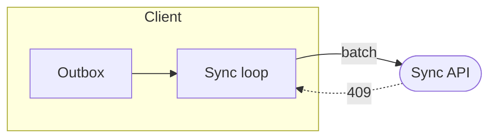

# Conduit Interactive Plan skill

This skill teaches you to write a feature plan the human can edit **in place**. The plan is one
plain Markdown file. Conduit opens it as a document: prose is a rich-text editor, a `ts` fence is a
type-checked Monaco editor, and a `mermaid` flowchart is a node-and-edge canvas the human can drag,
rename and rewire.

You need no Conduit-specific markup. Write good Markdown; the app supplies the editors.

The human edits the same file you wrote, comments on individual blocks, and presses **Send** to
paste their changes and comments back at you. Your job each turn is to read those comments, revise
the file, and reply.

## Where the plan lives

One plan is one file at `<projectRoot>/.conduit/plans/<slug>.md`.

The slug is the filename without the extension and must match `/^[a-z0-9][a-z0-9_-]{0,63}$/i`:
start with a letter or digit, then letters, digits, `-` or `_`, up to 64 characters. The extension
must be lowercase `.md`. A file that misses either rule still opens — as a read-only Markdown
preview, not as a plan.

Pick a slug that names the feature: `.conduit/plans/offline-sync.md`.

Frontmatter is optional and preserved as written. Only two keys mean anything:

```md
---
title: Offline sync
status: draft
---
```

`status` is `draft` or `agreed`. Everything after the frontmatter is the plan.

## The three block kinds

A block is one top-level Markdown node: a heading, a paragraph, a list, a table, a quote, or a
fence. Keep blocks small — a block is the unit the human comments on, the unit marked as changed,
and the unit pasted back to you.

### Prose

Headings, paragraphs, lists, tables and quotes render as an editable document. Write normal
Markdown.

```md
## Sync loop

The client replays its outbox on reconnect, oldest first. A conflict is resolved
server-side; the client never merges.
```

One idea per paragraph. The human comments per block, so a paragraph that carries three decisions
cannot be answered precisely.

### Signatures — a `ts` fence

A ```` ```ts ```` fence (also `tsx`) is a live Monaco editor, type-checked against the project's
TypeScript worker. Write **self-contained signatures and types — no bodies**.

````md
```ts
export interface OutboxEntry {
  id: string;
  op: 'put' | 'delete';
  key: string;
  queuedAt: string; // ISO-8601 UTC
}

export function replayOutbox(entries: readonly OutboxEntry[]): Promise<number>;
```
````

**Never write an `import` statement.** Each fence is compiled on its own, outside your source tree,
so no module specifier resolves and the block shows a red error. If a signature needs a type from
elsewhere, declare it in the same fence.

Any other language (`js`, `json`, `sh`, …) gets syntax highlighting only — no type checking, no
editor. Use those for commands and payloads, not for contracts.

### Diagrams — a `mermaid` fence

A ```` ```mermaid ```` fence holding a flowchart becomes a structural editor. Write `flowchart <DIR>`,
where `<DIR>` is `TB`, `TD`, `BT`, `LR` or `RL`. The direction is required. (`graph <DIR>` parses
identically; prefer `flowchart`.)

````md

````

The supported subset, exactly:

- Header `flowchart <dir>` or `graph <dir>`, one of `TB`, `TD`, `BT`, `LR`, `RL`.
- Nodes: `id`, `id[label]`, `id(label)`, `id([label])`, `id[[label]]`, `id{label}`, `id((label))`.
  An id is `[A-Za-z0-9_][A-Za-z0-9_-]*`.
- Labels may be quoted: `id["a label, with punctuation"]`. A `"` **inside** a label is written as
  the entity `#quot;` — a bare quote ends the label and breaks the parse.
- Edges: `-->`, `---`, `-.->`, `==>`, `<-->`. Chains work: `a --> b --> c`.
- Edge labels: `a -->|batch| b` or `a -- batch --> b`. **Every token is whitespace-separated**:
  `a-->b` and `a -->|x|b` are out of the subset.
- `subgraph id [title]`, `subgraph id`, or `subgraph "title"` (the id is slugged from the title),
  closed by `end`, nestable.
- `%%` comment lines are accepted but **dropped** — they do not survive a structural edit.
- `classDef`, `class`, `style`, `click` and `linkStyle` lines are kept verbatim as an opaque
  trailer.

Everything else is out: `&` fan-out, `:::class`, `~~~`, `{{hexagon}}`, `>flag]`, `direction` inside
a subgraph, and any line the rules above don't cover. An unsupported fence is not an error — the
block renders as a read-only picture with an **Edit as text** button, and the human loses the
structural editor for it.

One shape is worse than unsupported: `db[(Store)]` **parses**, as a rectangle whose label is the
literal text `(Store)`, and a structural edit writes it back as `db["(Store)"]`. Stay inside the
six shapes listed above.

**Never write positions, and never write `classDef` unless you mean them.** Layout is computed on
every render and dragging is session-only, so coordinates are neither read nor written. A `classDef`
you add is preserved forever, in every rewrite, as styling the human did not ask for.

## Every turn: read the comments

The human's comments live beside the plan in `.conduit/plans/<slug>.comments.json`. **Read it at
the start of every turn** and address every comment whose `status` is `"open"`.

```jsonc
{
  "conduit": 1,
  "kind": "plan-comments",
  "updatedAt": 1750000000000,        // Date.now() at write time
  "data": {
    "version": 1,
    "baseline": { "at": "…", "blockHashes": ["…"] },   // NOT YOURS — see below
    "comments": [
      {
        "id": "cmf3k2q9x1",
        "author": "human",
        "text": "Split this — the loader and the conflict rule are two decisions.",
        "anchor": { "index": 2, "hash": "1a2b3c4d", "snippet": "## Sync loop" },
        "status": "open",
        "createdAt": "2026-09-19T14:01:02Z",
        "sentAt": "2026-09-19T14:03:40Z"
      }
    ]
  }
}
```

`anchor.index` is the block's position in the file (0-based, frontmatter excluded) and
`anchor.snippet` its first line — that is which block the human is talking about.

For each open comment:

1. **Edit the plan file** to address it.
2. **Append a reply** — a new comment with `"author": "agent"`, `"replyTo"` set to the comment's
   id, and the same `anchor`, copied unchanged even if you rewrote that block. Conduit re-anchors
   comments when it loads the file.
3. **Set the original's `status` to `"resolved"`**, changing nothing else on it.

```jsonc
{
  "id": "agent-1",                    // any id unique within the file
  "author": "agent",
  "replyTo": "cmf3k2q9x1",
  "text": "Split into §2 (loader) and §3 (conflict rule).",
  "anchor": { "index": 2, "hash": "1a2b3c4d", "snippet": "## Sync loop" },
  "status": "resolved",
  "createdAt": "2026-09-19T14:20:00Z"
}
```

Give your reply `"status": "resolved"` too. An `open` comment counts as unanswered in the human's
Send badge and is pasted straight back at you on their next Send.

Rules the app applies silently — get these wrong and content disappears without an error:

- **Never write, move or invent `baseline`.** It is the human's send marker: the block hashes their
  changes are measured against. Rewriting it makes their next Send either empty or a paste of the
  whole document. Copy it through untouched, or leave it absent if it is absent.
- **Append and flip status; never delete or rewrite a comment.** The human's own edits merge by
  `id`, so a comment you drop is gone from their view.
- Write the whole envelope. `version` must be `1` and `comments` must be an array; otherwise the
  file reads as **no comments at all** and every thread vanishes.
- Every comment needs all of `id`, `author` (`human` | `agent`), `text`, `anchor`
  (`{ index, hash, snippet }`), `status` (`open` | `resolved`) and `createdAt` (ISO-8601 UTC). An
  entry missing one is dropped on load. `text` is Markdown, 4 KB max.
- If the file does not exist there are no comments yet. Create it only when you have a reply to
  write.

## What the human sends you

**Send** pastes a message into your terminal. It looks like this:

```
Plan: .conduit/plans/offline-sync.md — I edited it and left comments.
Changed blocks (2):
- §3 code (ts):
export function replayOutbox(entries: readonly OutboxEntry[]): Promise<number>;
- §1 prose "The client replays its outbox on reconnect":
The client replays its outbox on reconnect, newest first.
Removed blocks: 1
Open comments (1):
- §2 ## Sync loop: "Split this — the loader and the conflict rule are two decisions."
Please revise the plan file, reply to each comment in .conduit/plans/offline-sync.comments.json, and tell me what you changed.
```

**Changed blocks** are the blocks *the human* rewrote, quoted verbatim as they now stand on disk.
They are already in the file — do not re-apply them. They are there so you know what the human
decided and can make the rest of the plan consistent with it. Blocks you changed yourself are never
listed back to you.

`§n` is the block's position in the file, counting from 1 — so `§3` is `anchor.index` 2.
`Removed blocks: n` appears when the human deleted blocks; it is a count, not a list.

Re-read the file before editing. It is the source of truth, and the human may have kept editing
since they pressed Send.

## Do not rewrite blocks you were not asked to change

A block has no id in the file. Its identity **is its content**: a hash of the block's text. Rewrite
a block and it becomes a different block — every comment anchored to it detaches, and the human's
question survives with nothing to point at.

So: change the blocks the feedback is about, and leave the rest byte-for-byte. Do not reformat, do
not re-wrap prose, do not reorder sections, do not "tidy" a diagram while fixing a sentence.
Untouched bytes are how the human sees what you actually did — their diff of the file is the
feedback loop.

A full-file rewrite is the failure mode this rule names: it detaches every comment and marks every
block as changed, burying the one edit that mattered.

## When to use

Use this whenever you would otherwise dump a multi-step plan into the terminal, and for any design
the human is going to push back on. Write the file, tell them the path, and wait for their Send.
