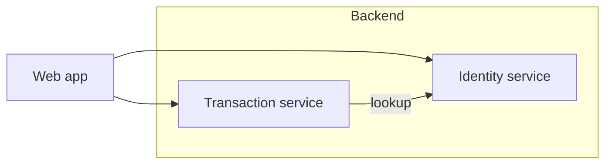

# Identity service

The web app authenticates against the identity service, which owns accounts and session
tokens. Nothing else in the system writes to the account store.

Transactions carry a payer id, so the transaction service looks an account up on every
write. That lookup is the only coupling between the two backend services.

```ts
export function createIdentity(input: { email: string }): Promise<{ id: string }>
```


