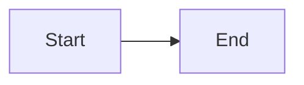

# Rich content test fixture

## Valid mermaid diagram



## Broken mermaid diagram

```mermaid
not valid mermaid syntax !@#$%
```

## Regular code block (should still highlight)

```typescript
const x: number = 42;
```
